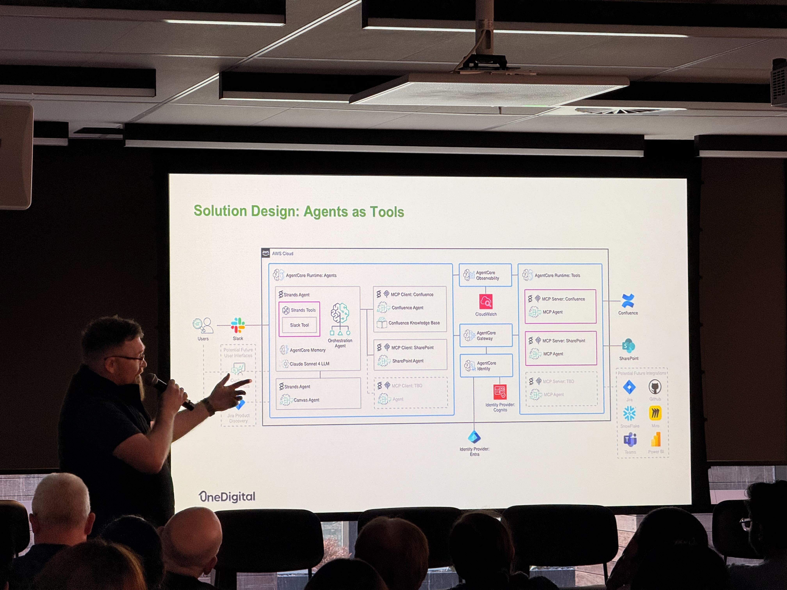
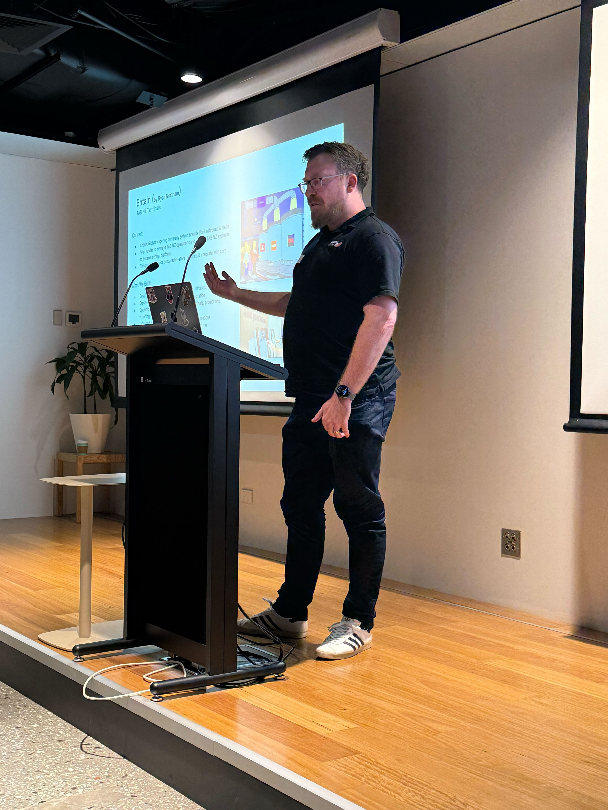

# Building Stakeholder Relationships

> Building relationships that exist beyond day-to-day interactions. Measures of
> success include being trusted to make decisions, being sought for opinions,
> being offered new business, and providing unique insights.

## Sought out for AgentCore expertise

After the Wesfarmers engagement, I'd developed solid experience with AWS Bedrock
AgentCore and Strands Agents, which is still fairly new technology with limited
expertise across the industry. Another team within Mantel reached out to me for
advice on their project using the same technology. They wanted to understand
capabilities, limitations, and practical implementation patterns. I was able to
share what I'd learned and help them avoid pitfalls I'd encountered. It felt
good to be the go-to person for something I'd invested time in learning.

## Invited to present at AWS Melbourne

At Wesfarmers, I researched the newly released preview of AWS AgentCore and
assessed that it was a strong fit for our rapid proof-of-concept use case. I
presented the findings to both Wesfarmers and AWS stakeholders and secured their
buy-in to proceed. I was invited back to share the work with the broader
Wesfarmers group at the AWS offices in Melbourne, which extended the
relationship beyond the immediate project and put Mantel in front of a wider
audience within the client organisation.

## Built lasting client relationship at Entain

At Entain, I worked closely with the development manager throughout the TAB NZ
terminals migration. We formed a strong working relationship through consistent
delivery and open communication. After successful project completion, Entain
invited our Mantel team to their celebration dinner in Brisbane. They flew us up
to meet their team, work from their office, and celebrate together. This went
beyond a typical client-vendor relationship. The invitation reflected genuine
appreciation and the connections we'd built during the engagement.

## Shared learnings with Mantel Digital

After the Entain project, there was interest within Mantel Digital about our
approach and lessons learned. I presented to the Mantel Digital group,
explaining the project approach, challenges we faced, and what worked. I also
shared what we'd do differently next time. This helped other teams learn from
our experience and apply relevant patterns to their own work.

## Earned contract extension through delivery

Mantel's initial engagement at Entain focused on the API uplift. The client was
uncertain whether the legacy system could be salvaged. After demonstrating that
the API could be refactored successfully and delivering on our commitment, the
client extended the contract to include the TAB NZ migration. This was a
significantly larger piece of work. The extension came from trusted delivery. The
client chose to expand the relationship rather than look elsewhere.

## Presented to ANZ technical leadership

The GitHub migration at ANZ was a high-profile project with many interested
stakeholders. ANZ technical leadership and GitHub account managers needed
visibility into progress and confidence that the migration was on track.

I presented the reporting dashboards and findings from my Bamboo analysis
directly to these stakeholders. They were senior people who cared about outcomes
and risk, not implementation details. Being trusted to present to this audience
and answer their questions directly was a sign that I'd earned credibility
through the work.

[← Back to README](README.md) | [Previous: Enabling Delivery](03-enabling-delivery.md) | [Next: Delegation →](05-delegation.md)
